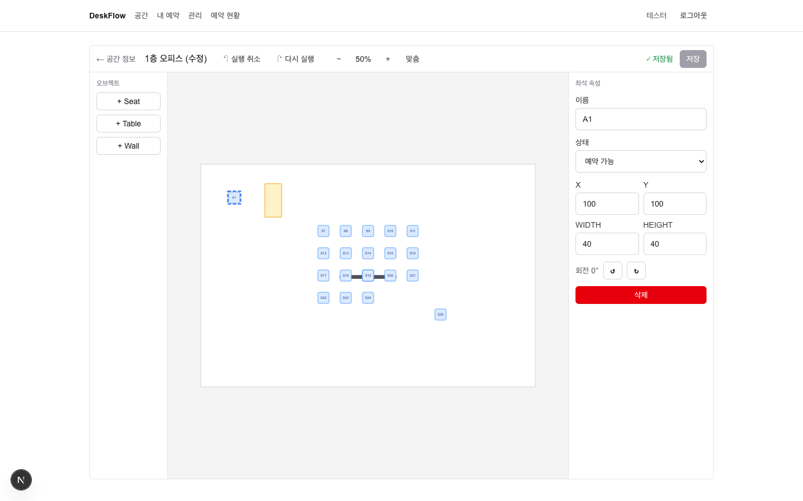
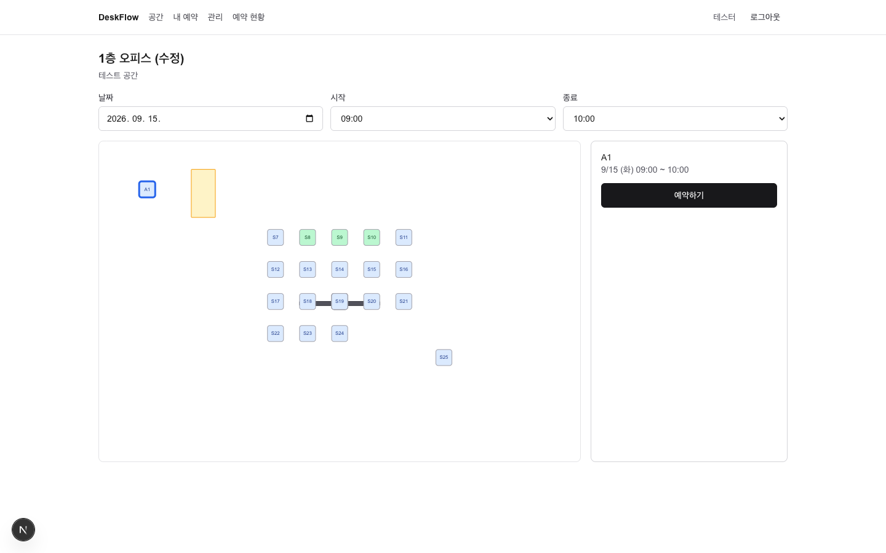

# DeskFlow

관리자가 웹에서 공간 배치도를 직접 편집하고, 사용자가 그 배치도 위에서 좌석을 예약하는 서비스.
핵심은 CRUD 가 아니라 **Interactive Space Editor** — 좌표 변환, Undo/Redo, Dirty 추적, 낙관적 동시성 제어를 직접 설계했다.

- 배포: **https://deskflow-pink.vercel.app**
- 체험 계정: 관리자 `tester1@example.com` / 사용자 `tester2@example.com` (비밀번호 `password123`)
- 문서: [PRD](./PRD.md) · [설계 스펙](./docs/superpowers/specs/2026-09-14-deskflow-mvp-design.md) · [의사결정 기록 48건](./docs/decisions.md) · [구현 계획 A/B/C](./docs/superpowers/plans/)

| 에디터 (관리자) | 예약 (사용자) |
|---|---|
|  |  |

## 기능

**관리자** — 공간 CRUD → 에디터에서 Seat / Table / Wall 추가 · 드래그 · 90° 회전 · 속성 편집 · 삭제 → Undo/Redo(Ctrl+Z / Shift+Z) → 휠 줌(커서 고정, 5단계) · Space+드래그 팬 → 명시적 저장 + 버전 충돌 감지 → 예약 현황 조회

**사용자** — 공간 목록 → 날짜 · 30분 단위 시간 선택 → 배치도에서 좌석 상태 확인(가능 / 예약됨 / 내 예약 / 사용 불가) → 예약 → 내 예약 조회 · 취소

**시스템** — 같은 좌석 · 겹치는 시간의 동시 예약은 Postgres exclusion constraint 가 하나만 통과시킨다. 저장되지 않은 편집은 표시되고 이탈 시 경고한다. 새로고침 후 배치가 유지된다.

## 기술 스택

Next.js 16 (App Router, `proxy.ts`) · React 19 · TypeScript strict · Tailwind v4 · **Zustand 5** (에디터 상태) · **TanStack Query 5** (서버 상태, SSR prefetch + hydration) · Zod 4 · Supabase (Postgres · Auth · RLS, `@supabase/ssr`) · Vitest 3 · pnpm · Vercel

라이브러리를 일부러 안 쓴 곳: 드래그는 Pointer Events 직접(dnd-kit 아님), 캔버스는 SVG 직접, 폼은 zod 만(React Hook Form 없음), UI 라이브러리 없음.

## 아키텍처

```
브라우저   app(pages) → widgets → features → entities → shared
                          │                      │
             Zustand Editor Store        TanStack Query 캐시 ── apiFetch ──┐
                                                                          │ HTTP /api/*
Next 서버  RSC page: prefetchQuery(/api/*, cookie 전달) → dehydrate         │
           app/api/**/route.ts  (얇음: requireUser/Admin → parse → service → 응답)
             └→ app/api/_server/**  (서비스 · 인증 가드 · 검증 · Postgres 에러 매핑)
                   └→ Supabase  (RLS 가 최종 방어)
           proxy.ts: 세션 쿠키 갱신, 미로그인 리다이렉트
```

원칙 세 가지:

1. **프론트는 Supabase 를 모른다.** `widgets / features / entities` 는 `/api` 와 `shared/contracts`(DTO + zod) 만 안다. Supabase 를 아는 파일은 `app/api/_server/**` 와 `proxy.ts` 뿐. ESLint(`eslint-plugin-boundaries`)가 역방향 import 를 막는다.
2. **서버 상태와 편집 상태의 접점은 세 곳뿐.** 로드 1회(`fromLayoutDto`), 저장 1회(`toSaveInput` → `PUT /layout`), 충돌 시 교체 1회(`replaceDocument`). refetch 가 편집 중 문서를 덮지 않는다.
3. **무결성은 DB 가 최종.** 예약 겹침은 exclusion constraint, 레이아웃 동시 저장은 `layout_version` 비교. 앱은 SQLSTATE(`23P01`, `P0001`) 를 409 로 매핑만 한다.

### 폴더

```
src/
  app/api/_server/      백엔드. db/(supabase 클라이언트, 생성 타입) http/(errors, response, auth, validate) rooms/ reservations/ auth/
  app/api/**/route.ts   Route Handler 16개
  app/(public|user|admin)/  페이지. RSC 가 prefetch, 위젯이 useSuspenseQuery
  widgets/              room-editor · room-reservation · my-reservations · admin-reservations · app-header
  features/             room-editor(스토어·캔버스·툴바·패널·저장) · room-manage · reservation-create · reservation-cancel · auth
  entities/             room(queryOptions, RoomMap) · reservation(queries, time-slots, overlap) · user
  shared/contracts/     서버·클라 공유 DTO + zod = API 명세
  shared/api/           apiFetch, QueryClient, server-fetch-context
supabase/migrations/    0001 스키마·RPC·RLS, 0002 reservation_details 뷰
scripts/db-smoke.sh     임시 Postgres 에 마이그레이션 적용 + 제약 검증
```

### 에디터 상태 (Zustand)

```ts
document: { roomId, width, height, objects: Record<id, SpaceObjectDto>, order: id[] }   // 불변. 변경 = 새 객체
history:  { past: EditorDocument[], future: EditorDocument[] }                         // 스냅샷 참조, 상한 100
persistence: { savedDocument, inFlightDocument, layoutVersion, status, error }
viewport: { zoom, offsetX, offsetY }   selectedObjectId   interaction   settings { gridSize: 10 }
```

- **Dirty** = `document !== savedDocument` (참조 비교). Undo 로 저장 시점 참조에 돌아오면 자동으로 clean.
- **드래그 1회 = 히스토리 1단계**: `beginGesture()` 가 스냅샷을 잡고, `moveObject()` 는 히스토리 없이 문서만 바꾸고, `endGesture()` 가 1단계로 push.
- **저장 중 편집 보존**: 요청 시점 문서를 `inFlightDocument` 에 두고 성공 시 그것만 `savedDocument` 로. 저장 중 편집은 dirty 로 남는다.

### 좌표계

SVG 한 장, `<g transform="translate(offsetX offsetY) scale(zoom)">` 하나가 뷰포트. 오브젝트는 캔버스 좌표만 알고 zoom 을 모른다.

```
screen = canvas · zoom + offset          canvas = (screen − offset) / zoom
줌(앵커 고정): offset' = anchorScreen − screenToCanvas(anchorScreen) · zoom'
드래그: topLeft = screenToCanvas(pointer) − grabOffset    (절대 계산, 오차 누적 없음)
```

## 실행

```bash
pnpm install                                   # Node 22 는 pnpm-workspace.yaml 의 useNodeVersion 이 고정
cp .env.example .env.local                     # NEXT_PUBLIC_SUPABASE_URL, NEXT_PUBLIC_SUPABASE_PUBLISHABLE_KEY
supabase link --project-ref <ref> && supabase db push          # 스키마 적용
supabase gen types typescript --linked --schema public > src/app/api/_server/db/database.types.ts
pnpm dev
```

- Supabase 대시보드 Authentication → Email → **Confirm email 끄기** (가입 즉시 로그인).
- 첫 관리자: `supabase db query --linked "update public.profiles set role='admin' where id=(select id from auth.users where email='you@example.com')"`

```bash
pnpm typecheck && pnpm lint && pnpm test      # 테스트 78개 (순수 로직 · 스토어 · 매퍼 · 계약)
pnpm db:smoke                                  # 로컬 임시 Postgres 로 마이그레이션·제약 검증 (Homebrew postgresql 필요)
vercel --prod                                  # 배포
```

## 기술 결정 (요약)

전체 48건은 [docs/decisions.md](./docs/decisions.md). 대안과 이유가 각각 기록돼 있다.

| 결정 | 이유 | 기록 |
|---|---|---|
| Route Handler + `_server` 격리, Server Action 미사용 | HTTP 계약이 명시적, 409 같은 의미 전달, 백엔드 교체 지점 명확 | D-08, D-09 |
| 서버 prefetch 도 `/api` 호출 (queryFn 한 벌) | 프론트가 Supabase 를 전혀 모름. RSC 는 origin + cookie 를 명시적으로 전달 | D-10 |
| `seats` 테이블을 `space_objects` 와 분리 | 예약 FK 가 좌석만 가리킴. 재저장 시 seat.id 유지(예약 안전) | D-25 |
| 예약 겹침 = exclusion constraint | 동시 요청도 DB 가 직렬화. 앱은 23P01 → 409 매핑만 | D-29 |
| 명시적 저장 + `layout_version` | 편집 중간 상태가 서버에 안 감. 관리자 둘의 동시 저장 충돌 감지 | D-31 |
| 스냅샷 히스토리, Dirty 는 참조 비교 | 구현 단순, Undo 로 저장 상태 복귀 시 자동 clean | D-18, D-19 |
| SVG + Pointer Events 직접 | 요소 단위 히트 테스트를 SVG 가 해 줌. 좌표 변환을 직접 소유 | D-02, D-06 |
| `reservation_details` 뷰(security_invoker) | 4단 조인을 뷰 하나로, RLS 그대로 적용 | D-44 |

## 트러블슈팅 기록

- **환경변수 검증 위치**: 초기 시도에서 `proxy.ts` 가 import 시점에 env 를 zod parse → 키 이름 하나 달라서 전 요청 500. 지금은 사용하는 함수 안에서 검증하고 메시지에 키 이름을 넣는다 (D-32).
- **pnpm 이 Node 20 으로 실행**: 머신의 pnpm 이 다른 Node 위에서 돌아 Vite 7 이 `ERR_REQUIRE_ESM`. `pnpm-workspace.yaml` `useNodeVersion` 으로 프로젝트만 고정. `.npmrc` `use-node-version` 은 Vercel 이 거부해서 옮김 (D-38, D-48).
- **좌표 검증의 함정**: 브라우저 테스트에서 드래그 결과가 클램프 모서리로 튀었다 → 페이지 로딩 중(fit 전)에 좌표를 측정한 테스트 문제였다. 실제 로직은 줌 0.5/1.5 에서 픽셀 단위로 정확.
- **성공 문구가 사라짐**: 예약 성공 시 선택을 해제하니 패널이 언마운트돼 "예약되었습니다" 가 안 보임 → 위젯 배너(`role=status`)로 이동 (D-45).
- **`react-hooks/purity`**: 렌더 중 `Date.now()` 금지. 기준 시각은 `useState(() => Date.now())` 로 1회 고정 (D-46).
- **Supabase 뷰 타입은 전부 nullable**: 생성 타입 한계. 매퍼가 null 을 명시적으로 거른다.
- **macOS 키체인 프롬프트**: Supabase CLI 를 업그레이드하면 저장된 토큰 접근 권한을 다시 묻는다. Mac 로그인 비밀번호 + 항상 허용.

## 자주 받는 질문 (PRD 21절)

1. **캔버스 ↔ 화면 좌표 변환은?** `screen = canvas·zoom + offset`. 역변환은 `(screen − offset)/zoom`. 구현은 `features/room-editor/lib/geometry.ts`, 왕복 테스트 있음.
2. **줌 상태에서 드래그 좌표는?** 포인터를 캔버스 좌표로 바꾼 뒤 잡은 지점의 오프셋(`grabOffset`)을 빼서 절대 위치를 계산한다. delta 누적이 아니라 오차가 쌓이지 않고, 줌이 바뀌어도 식이 같다.
3. **Undo/Redo 자료구조는?** `past[] / present / future[]` 스냅샷. 문서가 불변이라 참조만 쌓인다. 드래그는 `begin/endGesture` 로 1단계. 상한 100.
4. **Editor State 와 Server State 를 왜 분리했나?** 편집 중 문서는 서버에 없는 상태다. TanStack Query 캐시에 넣으면 refetch·무효화가 편집을 덮는다. 접점을 로드·저장·충돌 교체 세 곳으로 제한했다.
5. **왜 Autosave 가 아닌 명시적 Save?** 중간 상태(반쯤 옮긴 좌석)가 사용자에게 노출되면 안 되고, 버전 충돌을 사용자가 판단할 시점이 필요하다. Dirty 표시 + 이탈 경고로 분실은 막는다.
6. **동시에 같은 좌석을 예약하면?** `EXCLUDE USING gist (seat_id WITH =, tstzrange(start_at,end_at,'[)') WITH &&) WHERE status='reserved'`. 트랜잭션 직렬화는 DB 몫. 두 계정 동시 POST 3라운드에서 매번 하나만 201.
7. **프론트 검증만으로 왜 안 되나?** 두 클라이언트가 같은 "비어 있음" 을 보고 동시에 보낸다. 앱 서버에서 select-then-insert 를 해도 경쟁 조건은 같다. 제약은 DB 에만 있어야 한다.
8. **SpaceObject 와 Seat 을 왜 분리했나?** 예약이 좌석에만 붙어야 한다(`reservations.seat_id → seats.id`). 좌석 속성(이름·상태)이 늘어나도 table/wall 에 nullable 컬럼이 생기지 않는다.
9. **새 Object Type 추가 시 재사용은?** 문서 모델·드래그·회전·선택·히스토리·저장은 type 을 모른다. 바꾸는 곳은 `DEFAULT_OBJECT_SIZE`, `createObject` 의 switch, `SpaceObjectView` 색 표, zod 유니온 네 곳.
10. **모바일 Editor 는?** MVP 범위 밖. 예약 화면은 `viewBox` 로 폭에 맞추고 세로 스택. 에디터는 md 미만에서 안내만.
11. **오브젝트가 수천 개면?** 문서 모델이 렌더러와 독립이라 SVG → Canvas 2D 전환이 가능하다. 그 전엔 뷰포트 밖 오브젝트 컬링, 드래그 중 선택 오브젝트만 별도 레이어.
12. **저장 실패 시 에디터 상태는?** 문서는 건드리지 않는다. 네트워크 오류는 "다시 시도", 409 는 "서버 버전 불러오기 / 계속 편집". 저장 중 편집은 `inFlightDocument` 로 분리돼 성공해도 dirty 로 남는다.

## 범위 밖 (의도적으로 안 한 것)

실시간 협업 · 모바일 에디터 · Playwright E2E(브라우저 검증은 Playwright MCP 로 수동 수행) · 리사이즈 핸들 · 다중 선택 · 자유 회전 · 반복 예약 · 알림
